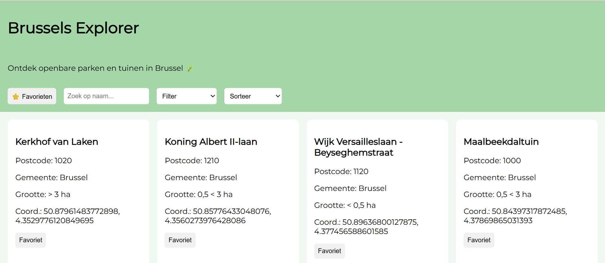

Dynamic web Projectweek 2026 - Laure-Grace Lokiyo & Samantha Karengera
# Brussels Explorer

Brussels Explorer is een interactieve webapplicatie waarmee gebruikers interessante openbare parken en tuinen in Brussel kunnen ontdekken met behulp van open data van de opendata.brussels API.

De applicatie biedt functies zoals het bekijken van locaties (coordinaten), zoeken, filteren, sorteren en het opslaan van favorieten voor een gepersonaliseerde ervaring.

---

##  Team / Taakverdeling

- **Laure-Grace Lokiyo** – Projectopzet, JavaScript, API-integratie, userstories/backlog 
- **Samantha Karengera** – Projectopzet, HTML-structuur, CSS en README

## Technische vereisten

## Technische vereisten

| Concept | Waar gebruikt / uitleg | Bestand | Regel(s) |
|--------|----------------------|--------|---------|
| Elementen selecteren | `getElementById` voor container, inputs | script.js | r.5-8 |
| Elementen manipuleren | `innerHTML`, `appendChild` voor kaarten | script.js | r.55-72 |
| Events koppelen | `addEventListener` op input, select, buttons | script.js | r.74-78 |
| Constanten | `const apiUrl` en DOM elementen | script.js | r.1-7 |
| Template literals | HTML in JS met `${}` | script.js | r.59-67 |
| Iteratie over arrays | `.forEach()` bij tonen van kaarten | script.js | r.55 |
| Array methodes | `.map()` bij data ophalen | script.js | r.16-22 |
| Array methodes | `.filter()` bij zoeken/filter/favorieten | script.js | r.33-44 |
| Arrow functions | `(a,b)=>{}` bij sorteren en events | script.js | r.45-52 |
| Conditional (ternary) | knop tekst favoriet/verwijder | script.js | r.65 |
| Callback functions | functies in `.forEach()` en events | script.js | r.55, r.70 |
| Promises | `fetch().then()` in favorieten pagina | favorieten.js | r.6-7 |
| Async & Await | `async function haalDataOp()` | script.js | r.10-13 |
| Fetch API | `fetch(apiUrl)` | script.js | r.11 |
| JSON manipulatie | `res.json()` en `.map()` | script.js | r.12-16 |
| LocalStorage | `getItem` en `setItem` voor favorieten | script.js | r.8, r.66 |
| Formulier validatie | `.trim()` bij zoekinput | script.js | r.31 |
| CSS Grid | layout kaarten | style.css | r.18-23 |
| Flexbox | header layout | style.css | r.6-10 |
| Basis CSS | kleuren, spacing, styling | style.css | volledig bestand |
| Gebruiksvriendelijke elementen | knoppen, dropdowns, UX | alle bestanden | overal |

## API

Link : https://opendata.brussels.be/explore/dataset/parcs_et_jardins_publics/information/?sort=-type&refine.type_txt=%3E+3+ha&refine.source=Ville+de+Bruxelles+-+D%C3%A9veloppement+Urbain+-+Planification+et+D%C3%A9veloppement&q.timerange.last_update=last_update:%5B2024-01-01+TO+2026-04-03%5D

## Bronnen
 AI chatlog hier nog toevoegen

## Screenshot
