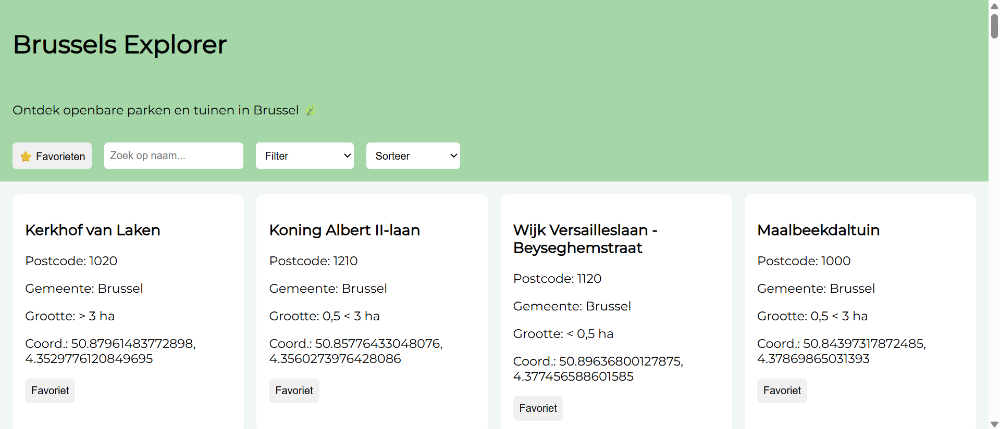

Dynamic web Projectweek 2026 - Laure-Grace Lokiyo & Samantha Karengera
# Brussels Explorer

Brussels Explorer is een interactieve webapplicatie waarmee gebruikers interessante openbare parken en tuinen in Brussel kunnen ontdekken met behulp van open data van de opendata.brussels API.

De applicatie biedt functies zoals het bekijken van locaties (coordinaten), zoeken, filteren, sorteren en het opslaan van favorieten voor een gepersonaliseerde ervaring.

---

##  Team / Taakverdeling

- **Laure-Grace Lokiyo** – Projectopzet, JavaScript, API-integratie, userstories/backlog 
- **Samantha Karengera** – Projectopzet, HTML-structuur, CSS en README

## Technische vereisten

## Technische vereisten

## Technische vereisten

| Vereiste | Waar gebruikt | Bestand + regel |
|----------|--------------|----------------|
| Elementen selecteren | document.getElementById | script.js (regels 4-7), favorieten.js (regel 2) |
| Elementen manipuleren | innerHTML, appendChild | script.js (regels 64-78), favorieten.js (regels 14-24) |
| Events koppelen | addEventListener | script.js (regels 81, 102-104), favorieten.js (regel 20) |
| Constanten | const apiUrl, container, inputs | script.js (regels 2-7) |
| Template literals | `${loc.naam}` etc | script.js (regels 67-74), favorieten.js (regels 15-18) |
| Iteratie over arrays | forEach | script.js (regel 60), favorieten.js (regel 12) |
| Array methodes | map, filter, sort | script.js (regels 17, 45, 53, 57), favorieten.js (regel 10) |
| Arrow functions | `(a,b)=>` | script.js (meerdere plaatsen zoals regel 53) |
| Conditional (ternary) | favoriet knop tekst | script.js (regel 74) |
| Callback functions | event handlers + forEach | script.js (regels 60, 81), favorieten.js (regel 20) |
| Promises | fetch().then() | favorieten.js (regels 6-8) |
| Async & Await | async function haalDataOp | script.js (regel 12) |
| Fetch API | data ophalen | script.js (regel 14), favorieten.js (regel 6) |
| JSON manipulatie | res.json() + map | script.js (regels 15-17) |
| LocalStorage | favorieten opslaan | script.js (regel 92), favorieten.js (regel 22) |
| Formulier validatie | (basis via input filtering) | script.js (regels 43-47) |
| Layout (CSS Grid) | kaartenContainer grid | style.css (regels 20-25) |
| Basis CSS | styling | style.css |
| Gebruiksvriendelijke UI | knoppen (favoriet/verwijder) | script.js (regel 74), favorieten.js (regel 17) |

## API

Link : https://opendata.brussels.be/explore/dataset/parcs_et_jardins_publics/information/?sort=-type&refine.type_txt=%3E+3+ha&refine.source=Ville+de+Bruxelles+-+D%C3%A9veloppement+Urbain+-+Planification+et+D%C3%A9veloppement&q.timerange.last_update=last_update:%5B2024-01-01+TO+2026-04-03%5D

## Bronnen
 ChatGPT : https://chatgpt.com/share/69cf809a-ae04-832f-8b91-19b297113a29 

## Screenshot
